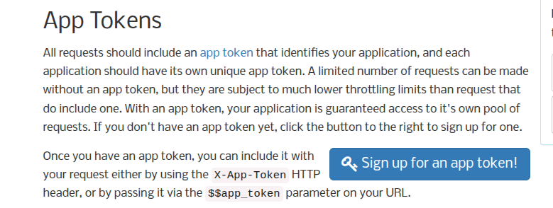

# MCP Datos Abiertos Col

Este código hace posible la implementación de un MCP enfocado a obtener datos de la plataforma gubernamental Datos Abiertos
Colombia. El cuál proporciona datos relevantes de Colombia.

Puede ser integrado en cualquier MCP Host(Claude, VS Code, etc.). Y no es necesario instalar nada. Simplement cumplir los siguientes pasos.

# Pasos para usar el MCP:

1. Tener algún MCP Host (Claude, VS Code, etc.), y tener Docker.
2. Obtener un `APP_TOKEN` en la página de datos abiertos col:

Información para la obtención del token: https://dev.socrata.com/foundry/www.datos.gov.co/2iz5-9bbz 



3. Pegar lo siguiente, en la configuración de MCP del Host.

```json
"datos-abiertos-col": {
        "command": "docker",
        "args": [
          "run",
          "-i",
          "--rm",
          "-e",
          "APP_TOKEN",
          "ccortesra/datos-abiertos-col:latest"
        ],
        "env": {
          "APP_TOKEN": "<token>"
        }
      }
```