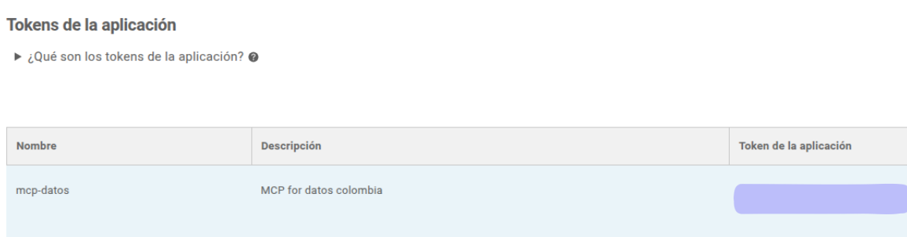
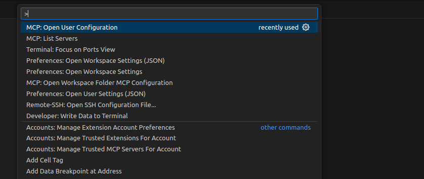
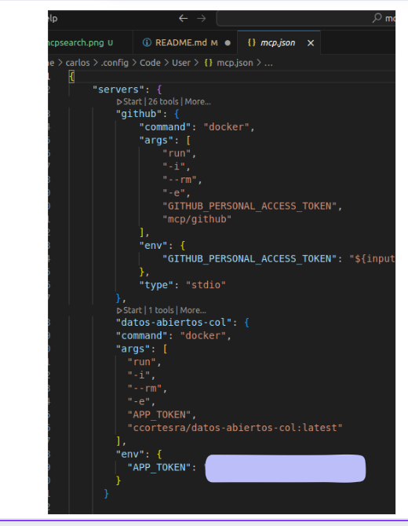
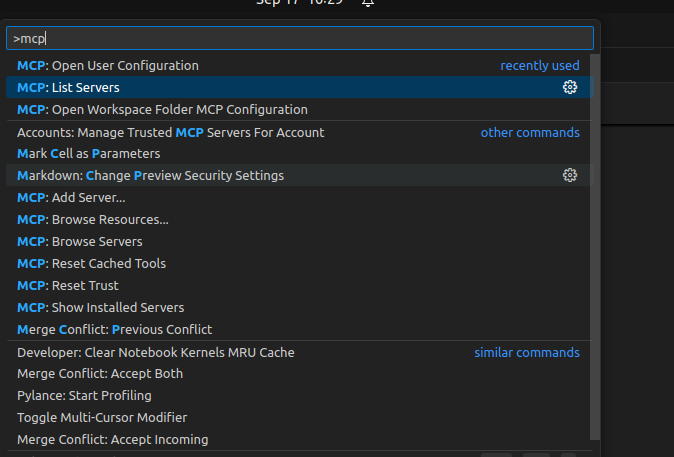
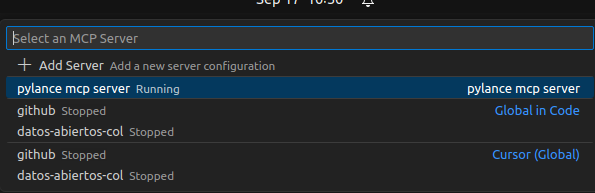
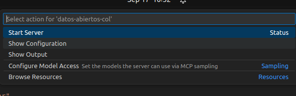
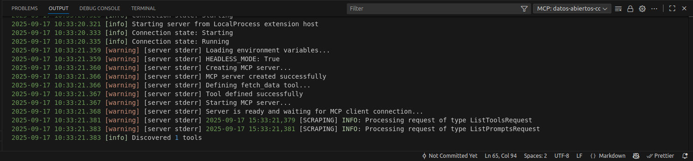
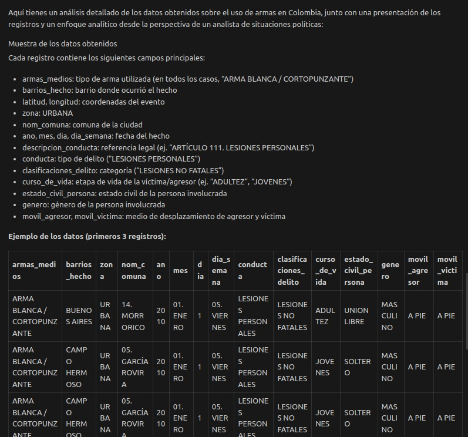

# MCP Datos Abiertos Col

Este código hace posible la implementación de un MCP enfocado a obtener datos de la plataforma gubernamental Datos Abiertos
Colombia. El cuál proporciona datos relevantes de Colombia.

Puede ser integrado en cualquier MCP Host(Claude, VS Code, etc.). Y no es necesario instalar nada. Simplement cumplir los siguientes pasos.

# Prerrequisitos

- Tener Docker instalado.
- Tener un MCP Host (Claude, VS Code, etc.)

# Pasos para usar el MCP:

1. Ingresar al link y obtener un `APP_TOKEN` en la página de Datos Abiertos Col:

Información para la obtención del token: https://dev.socrata.com/foundry/www.datos.gov.co/2iz5-9bbz 


Al entrar en los Developer Settings en la aplicación de datos abiertos, se debe evidenciar la existencia del token:



2. Abrir la configuración del MCP del host (estas instrucciones están enfocadas en VS Code, pero son similares en otros hosts).
Ingresar el atajo `Ctrl + Shift + P` y escribir `MCP: Open User Configuration`.



3. Al ingresar a dicha opción, aparecerán las configuraciones de los MCPs, en este caso ya había una del MCP de GitHub, y aparte añadí la de este MCP.



## **Configuración del MCP**

```json
"datos-abiertos-col": {
        "command": "docker",
        "args": [
          "run",
          "-i",
          "--rm",
          "-e",
          "APP_TOKEN",
          "ccortesra/datos-abiertos-col:latest"
        ],
        "env": {
          "APP_TOKEN": "<token>"
        }
      }
```

4. Si la configuración se pego bien, al hacer`Ctrl + Shift + P` y escribir `MCP: List Servers`, debe aparecer el MCP
de datos-abiertos-col.





5. Debes inicializar el MCP seleccionando la opción `Start Server`




6. Si la inicialización fue exitosa debes ver los logs de la pestaña `OUTPUT` similar a esto:



7. Ya puedes probar el MCP ! Abre la pestaña de GitHub Copilot, y dile que busque información de Colombia, sobre lo que quieras:

